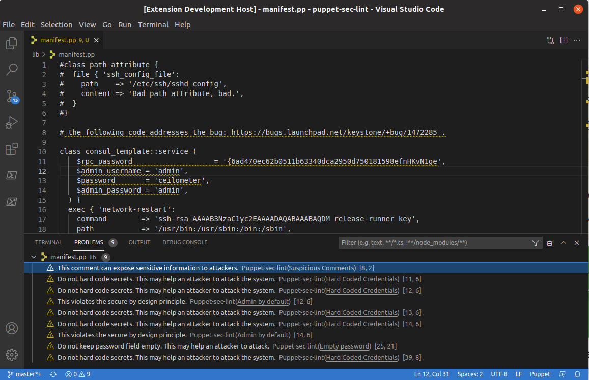
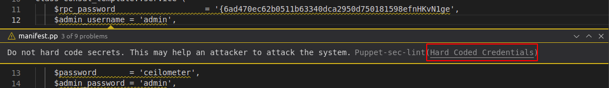
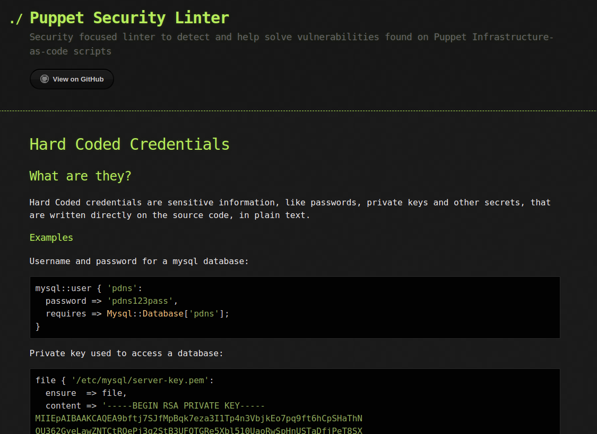

# Puppet Security Linter for Visual Studio Code

This extension integrates the [Puppet Security Linter](https://github.com/TiagoR98/puppet-sec-lint) analysis right into Visual Studio Code, ensuring a perfect continuity in a developer's workflow.

The extension uses the [puppet-sec-lint gem](https://rubygems.org/gems/puppet-sec-lint) installed on the local computer. If the gem is not yet installed on the computer, install it by running <code>gem install puppet-sec-lint</code>. 

More information on how to configure the linter can be found at the [official github repository]((https://rubygems.org/gems/puppet-sec-lint)).

## Features

When an Puppet (.pp) file is created or opened, the extension automatically starts running in real time. 

When a security vulnerabilty is detectes, a warning is imediately displayed, accompanied by a underline in the affected code.

By clicking on the link present in the warning, it's possible to consult a page with more information reagrding the vulnerabilities, how could they be exploited and solutions to mitigate or solve them.

## Release Notes

### 1.0.0

To be released